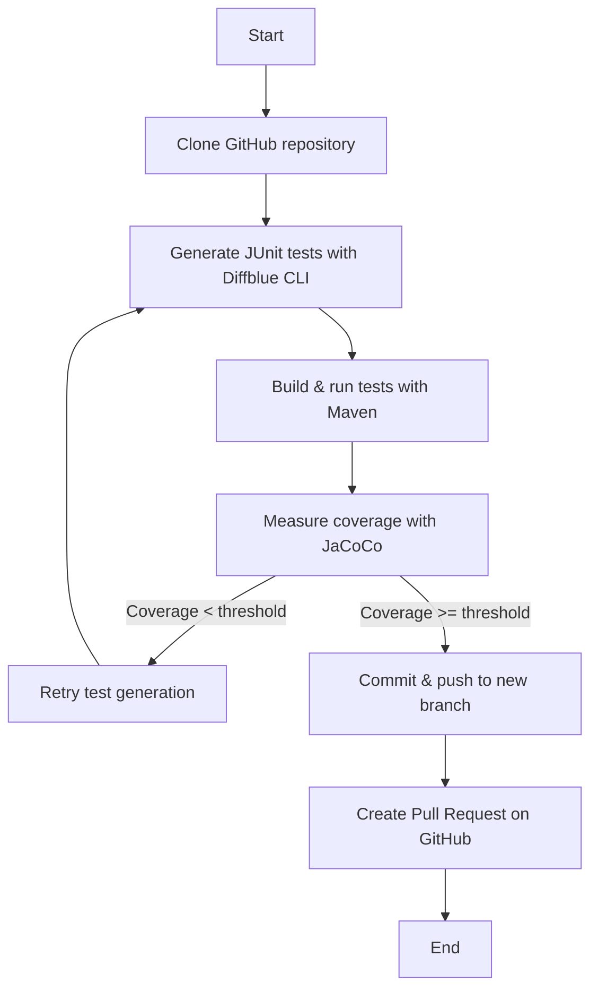

# JunitTest_Ginie
JunitTest_Ginie is a one‑click automation tool that clones a Java GitHub repository, generates high‑quality JUnit tests using Diffblue Cover, validates them with Maven &amp; JaCoCo, ensures coverage meets your target, and automatically pushes the changes to a new branch with an open Pull Request — all fully automated.

# JunitTest_Ginie

[](https://www.python.org/downloads/windows/)
[](https://adoptium.net/)
[](https://maven.apache.org/download.cgi)
[](LICENSE)

**JunitTest_Ginie** is a **Windows-ready**, **one-click automation tool** that:

- Clones a **Java GitHub repository**
- Generates **high-quality JUnit tests** using **Diffblue Cover CLI**
- Builds and runs all tests with **Maven**
- Measures coverage with **JaCoCo**
- Retries test generation until coverage meets your target
- Pushes generated tests to a **new branch**
- Automatically opens a **Pull Request** on GitHub

Perfect for developers and teams targeting **95–100% unit test coverage** with minimal manual effort.

---

## ✨ Features

- **One-click** end-to-end workflow from repo to PR  
- Intelligent JUnit test generation with **Diffblue Cover**  
- Maintains correct **package structure** & **naming conventions**  
- Automatic compilation, execution, and coverage validation  
- Configurable coverage threshold and retry count  
- Fully automated branch creation and PR submission  
- Designed for **Windows development environments**  

---

## 🛠 Requirements

Before running **JunitTest_Ginie**, install:

1. [Python 3.8+](https://www.python.org/downloads/windows/)  
2. [Java JDK 17+](https://adoptium.net/)  
3. [Apache Maven](https://maven.apache.org/download.cgi)  
4. [Git for Windows](https://git-scm.com/download/win)  
5. [Diffblue Cover CLI (Windows)](https://www.diffblue.com/download/) *(license or trial required)*  
6. Python dependencies:

   ```bash
   pip install PyGithub
   
### 📂 Installation
    # Step 1: Clone this repository
    git clone https://github.com/your-username/JunitTest_Ginie.git
    cd JunitTest_Ginie


    # Step 2: Install prerequisites
    # (Java, Maven, Git, Python, Diffblue CLI must be installed manually)

    # Step 3: Configure auto_test_pr_diffblue_windows.py
    GITHUB_TOKEN = "your_personal_github_token"
    REPO_URL = "https://github.com/your-username/your-java-repo.git"
    BRANCH_NAME = "feature/auto-generated-tests"
    COVERAGE_THRESHOLD = 95
    MAX_RETRIES = 3
    DIFFBLUE_CLI_PATH = r"C:\path\to\diffblue.exe"


    # Step 4: Ensure required tools are in PATH
    # java, mvn, git, diffblue.exe


## ▶ Usage
    # Run the script from PowerShell or Command Prompt
    python auto_test_pr_diffblue_windows.py

The script will:
1. Clone the target GitHub repository
2. Generate JUnit tests in src/test/java using Diffblue
3. Build & run tests with Maven
4. Measure coverage with JaCoCo
5. Retry if coverage is below target (MAX_RETRIES)
6. Commit & push to a new branch
7. Create a Pull Request on GitHub automatically

## 📄 Example Output
    [RUN] git clone "https://github.com/example/project.git" "C:\Temp\repo"
    [RUN] "C:\Tools\diffblue.exe" cover create --src "src\main\java" --test "src\test\java" --overwrite
    [RUN] mvn clean test
    Coverage: 96.23%
    ✅ Coverage threshold met: 96.23%
    [RUN] git checkout -b feature/auto-generated-tests
    [RUN] git add src/test/java
    [RUN] git commit -m "Automated JUnit test generation with Diffblue"
    [RUN] git push --set-upstream origin feature/auto-generated-tests
    Pull Request created: https://github.com/example/project/pull/42

## 📌 Notes
- Optimized for Maven-based Java projects (pom.xml required)
- Diffblue CLI requires a valid license or trial key 
- For Gradle projects, replace Maven commands with Gradle equivalents 
- Can be integrated into CI/CD pipelines for full automation

## 📜 License
This project is licensed under the GNU General Public License v3.0 – see the LICENSE file for details.

## 📊 Process Flow Diagram



